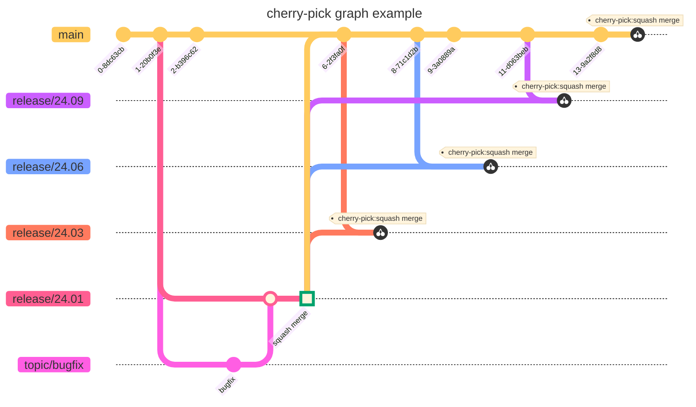

# cherry-pick example

This is automated cherry-pick commit example. generated by [recommit.dev](https://recommit.dev)

The repository has the following branches:

- release/24.01
- release/24.03
- release/24.06
- release/24.09
- main

In the `release/24.01` branch, checkout a `topic/bugfix` branch, fix the bug, merge it into the `release/24.01` branch, 
generate a `squash merge` commit, and then cherry-pick the `squash merge` commit to the `release/24.03`, `release/24.06`, `release/24.09`, 
and `main` branches.

